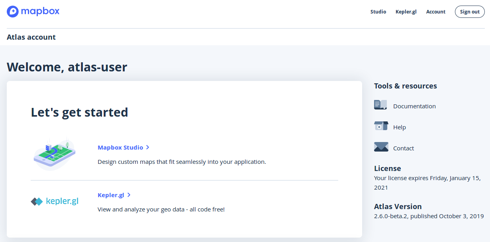

# Offline Mapping with Mapbox Atlas

Kinshasa Workshop

[Anjana Vakil](https://twitter.com/AnjanaVakil), Software Engineer @ [Mapbox](https://www.mapbox.com)

## Overview

In this hands-on workshop, we'll learn how to build custom maps & visualizations using open data and free, open-source, offline-ready tools from Mapbox. Through hands-on activities, we will cover basic Mapbox concepts and tools, including:
- Editing & styling maps in Mapbox Atlas, an offline map data & design tool
- Using custom Atlas styles for digitizing in JOSM
- Developing map visualizations with Kepler, a powerful and easy to use open source geospatial analysis tool for large-scale data sets
- Processing imagery and data for use in Mapbox Atlas

### Goals

By completing this workshop you'll learn how to...

Day 1:
- Create & publish a new style in Studio from a template
- Add a new layer with a custom tileset source to a style in Studio
- Build two different custom visualizations in Kepler from a single CSV dataset

Day 2:
- Set up & configure the Flyaway kit
- Load and process raster & vector data into tilesets
- Consume a published aerial imagery style from Atlas in JOSM

### Prerequisites

Some familiarity with working geographic data and OpenStreetMap is helpful. No experience with web mapping is required. Basic familiarity with the command line is assumed. But everyone is welcome.

### What you'll need

- Laptop with browser (Chrome or Firefox preferred)
- These workshop materials
- A wifi connection to the Atlas Flyaway kit closed network (see below)

#### Connect to the Atlas Flyaway Kit

Connect to the Atlas router's offline wireless network on a wifi-enabled laptop:
- network name (SSID): `flyaway-router` (or `flyaway-router-5G`)
- password: `nullisland`

Once connected to the network, navigate to http://192.168.1.2:2999/signin in your laptop's web browser and sign in with the following credentials:
- user: `atlas-user`
- password: `nullisland`

You should now see the main Atlas dashboard:

## Contents

### Day 1

#### [Part 1: Process vector data](process-vector-data.md)

* Load and process a GeoJSON file into a tileset

#### [Part 2: Style](create-style.md)

* Create & publish a new style in Studio from a template
* Add a new layer with a custom tileset source to a style in Studio

#### [Part 3: Kepler](kepler.md)

* Build two different custom visualizations in Kepler from a single CSV dataset

### Day 2

#### [Part 4: Fly Away Kit Admin](kit-admin.md)

* Power up & configure the Flyaway kit

### [Part 5: Process imagery](process-imagery.md)

* Load and process imagery into a tileset

### [Part 2: JOSM Editing](josm-edit.md)

* Consume in JOSM a published aerial imagery style from Atlas

## After this workshop

### Share what you #builtwithmapbox
We'd love to see whatever you build! Share on Twitter with the [`#builtwithmapbox`](https://twitter.com/hashtag/builtwithmapbox) hashtag so that we can amplify your work!

### Learn more
We've only scratched the surface of what Mapbox tools can do!

For more information & ideas, check out:
- The Mapbox [Documentation](https://docs.mapbox.com), including [Help](https://docs.mapbox.com/help/) and [Tutorials](https://docs.mapbox.com/help/tutorials)
- [The Mapbox Studio Manual](https://docs.mapbox.com/studio-manual/)
- [The Kepler User Guide](https://github.com/keplergl/kepler.gl/blob/master/docs/user-guides/j-get-started.md)

### Stay in touch

Keep up with [@Mapbox](https://twitter.com/mapbox) and [@AnjanaVakil](https://twitter.com/anjanavakil) on Twitter, and [contact Mapbox Community](https://www.mapbox.com/community) if you need any help with our tools.  

## Thank you

This workshop would not have been possible without:
- The amazing OSM DRC organizers, especially Claire Halleux
- My fabulous colleagues at Mapbox, especially Mikel Maron, Marena Brinkhurst, and the Atlas team
