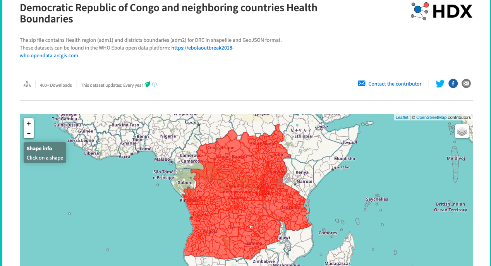

## Part 6: Process Vector Data on Atlas

### Goal

Load and process a GeoJSON into a tileset

### Requirements

A GeoJSON file

<!-- to prepare, we'll put regional ADM2 boundaries on the Fly Away Kit. https://opendata.arcgis.com/datasets/815dfe56234044f6927ffb7b1b67dee3_1.geojson-->

### Instructions

Find and download [Regional ADM2 boundaries](https://data.humdata.org/dataset/democratic-republic-of-congo-health-boundaries). This is a GeoJSON file.

Then place that imagery on the Atlas Fly Away Kit.

`scp DRC_ADM2.geojson atlas@192.168.1.2:/tmp/`

To use the data in Atlas, the GeoJSON needs to be processed into an mbtiles file. For that, we use [Tippecanoe](https://github.com/mapbox/tippecanoe). There is a convenience script on the Fly Away Kit to run Tippecanoe on a GeoJSON file, and then copy the result into the right directory.

`~/bin/geojson-to-tiles /tmp/DRC_ADM2.geojson`

These tiles are now available as layers in any style on the Fly Away Kit.

### Next step

[After this workshop](./README.md#after-this-workshop)
