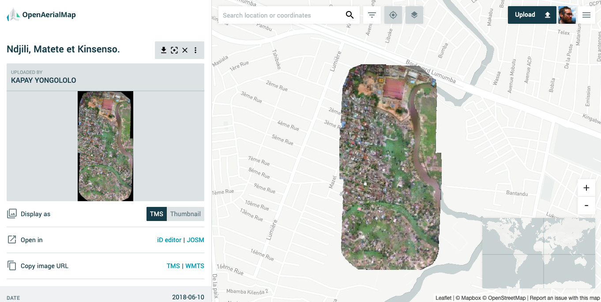

## Process Imagery on Atlas

### Goal

Load and process imagery into a tileset on Atlas

### Requirements

- An imagery file in `.tif` format (e.g. [ndjili.tif](./data/ndjili.tif))
- SCP & SSH access to the Atlas Flyaway Kit drive (see [Atlas Flyaway Kit Setup Guide](./docs/Atlas-Flyaway-Kit-Setup-Guide.pdf) for instructions).

### Instructions

- Find and download [Kinshasa UAV imagery from OpenAerialMap](https://map.openaerialmap.org/#/15.363425016403196,-4.3903893867821715,16/) (or download the local copy at [data/ndjili.tif](./data/ndjili.tif). This is a GeoTIFF file.

- Use a terminal on your own computer to copy that imagery onto the Atlas Flyaway Kit with SCP:

  `scp ndjili.tif atlas@192.168.1.2:/tmp/vakila-ndjili.tif`

- Start an SSH session with the Atlas machine to run the following commands (see [Atlas Flyaway Kit Setup Guide](./docs/Atlas-Flyaway-Kit-Setup-Guide.pdf) for instructions).

- To use the imagery in Atlas, the GeoTIFF needs to be processed into an `.mbtiles` file. For that, we use [Rasterio](https://github.com/mapbox/rio-mbtiles), which is already installed on the Atlas machine. Inside your SSH session, run the following command on the Atlas machine:

`rio mbtiles --src-nodata 0 --resampling bilinear --zoom-levels 13..20 -f PNG /tmp/vakila-ndjili.tif -o /tmp/vakila-ndjili.mbtiles`

To briefly explain the configuration arguments we use for rio mbtiles
* `-f PNG`: They need to be PNG format because JPEG doesn't support transparency
* `--src-nodata 0` because the source file doesn't carry a nodata value. Otherwise a black box would surround the imagery
* `--resampling bilinear` this resampling method looks good and is fast enough

Finally, move & rename the resulting mbtiles file to make it accessible to Atlas.

`% cp /tmp/ndjili.mbtiles ~/mbtiles/atlas-user.vakila-ndjili-uav.mbtiles`

The format for any tileset in Atlas consists of the Atlas user name (`atlas-user`), the name of the tileset, and the ".mbtiles" suffix.

These tiles are now available as layers in any style on the Fly Away Kit.
